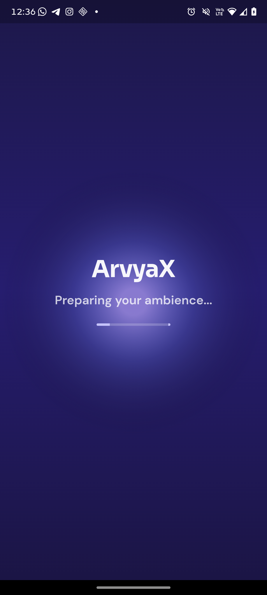
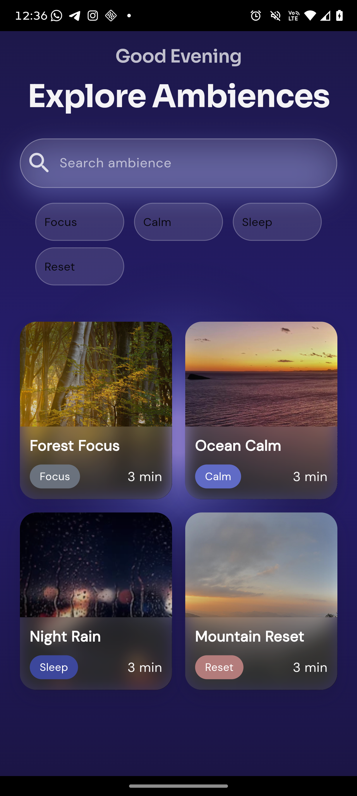
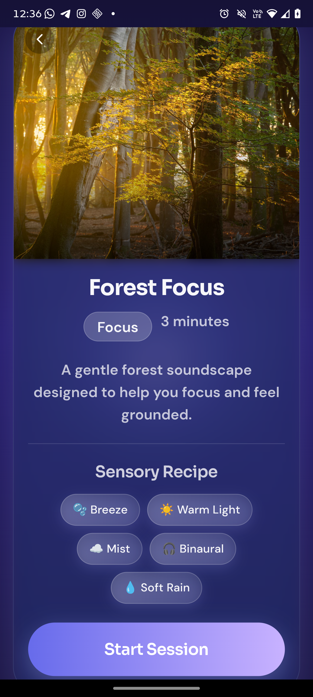
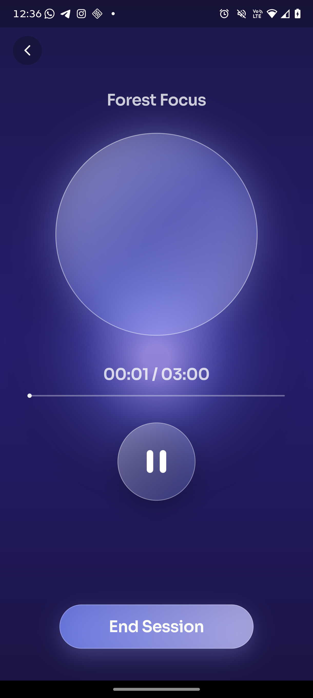
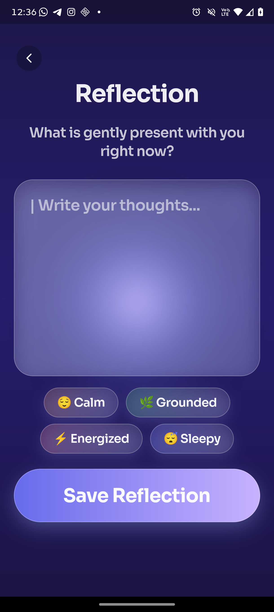
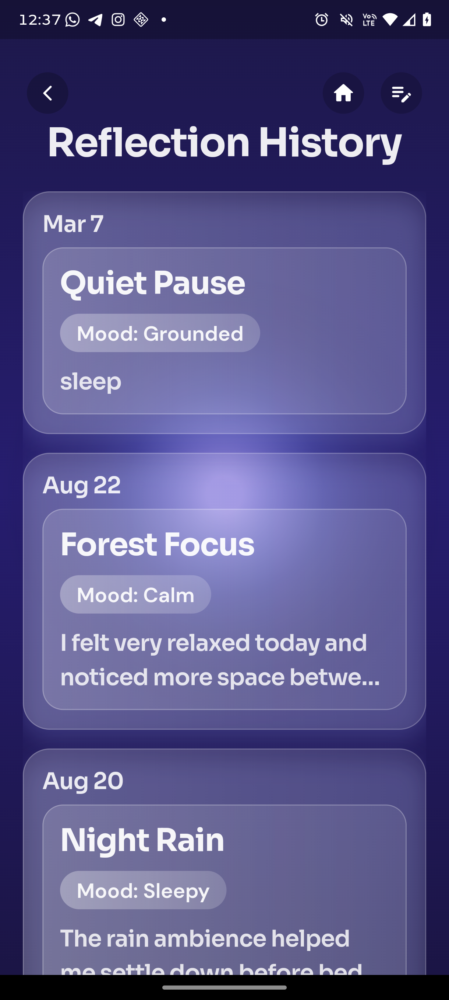

# ArvyaX - Immersive Ambience + Reflection App

A premium, calm Flutter app for ambience sessions and mindful journaling.

This project includes:
- ambience discovery
- immersive session playback
- mini player controls
- post-session reflection
- reflection history and detail views

## Demo
The app outputs are available in the `/outputs` folder (including screen recordings/screenshots).

### Screen Recording
- [Full App Demo (`outputs/screen-20260307-002547.mp4`)](outputs/screen-20260307-002547.mp4)

### Screenshots
#### Home


#### Ambience Details


#### Session Player


#### Reflection


#### Reflection History


#### Reflection Detail


## Features

### 1. Startup Loading Screen
- App opens with a branded loading screen
- Automatically transitions to Home

### 2. Home (Ambience Library)
- Greeting + title section
- Search bar (`Search ambience`)
- Tag filters: `Focus`, `Calm`, `Sleep`, `Reset`
- Responsive ambience card grid
- Empty state with `Clear Filters`
- Floating mini player when a session is active

### 3. Ambience Details
- Hero image
- Ambience metadata (title, tag, duration)
- Description
- Sensory recipe chips
- `Start Session` action

### 4. Session Player
- Immersive animated gradient background
- Breathing orb animation
- Real audio playback with `just_audio`
- Play/Pause and seek support
- Session timer logic fixed at 3:00
- Audio loops if shorter than 3:00
- `End Session` confirmation dialog

### 5. Reflection
- Prompt-based journaling input
- Mood chips: `Calm`, `Grounded`, `Energized`, `Sleepy`
- `Save Reflection` action

### 6. Reflection History
- Two clean states:
  - entries list state
  - empty state
- Tap entry to open reflection detail
- Header icon navigation (Back/Home/New Reflection)

### 7. Reflection Detail
- Full journal view
- Date, ambience title, mood badge
- UI matched to the same glassmorphism theme

## Session Duration Rule
All sessions are enforced to 3 minutes.

Behavior:
- Timer always runs for 3:00
- Audio loops continuously during session
- If source audio is shorter, it repeats automatically
- Session ends at 3:00 unless user ends manually

## Project Structure
```text
lib/
  data/
    models/
    repositories/

  features/
    ambience/
    player/
    journal/
    loading/

  navigation/
  shared/
    theme/
    widgets/
```

## Architecture
Feature-based clean structure with a repository + provider flow.

Data flow:
```text
Repository -> Riverpod Provider/Controller -> UI
```

## State Management
Uses `flutter_riverpod` for:
- filters/search state
- player/session state
- journal state

## Audio
Uses `just_audio` with local assets.

Configured ambience assets:
- `assets/audio/forest_focus.mp3`
- `assets/audio/ocean_calm.mp3`
- `assets/audio/night_rain.mp3`
- `assets/audio/mountain_reset.mp3`

## Storage Note
Journal data is currently stored in-memory via repository state (session-lifetime persistence).

If long-term persistence is required, the next step is adding Hive/SQLite.

## Packages
- `flutter_riverpod` - state management
- `just_audio` - audio playback
- `google_fonts` - typography
- `animations` - transition/animation utilities
- `glassmorphism` - UI styling support
- `lottie` - animation support

## How to Run
1. Clone repo
```bash
git clone <your-repo-url>
cd arvyax
```

2. Install dependencies
```bash
flutter pub get
```

3. Add audio files (required)
Place these files in `assets/audio/`:
- `forest_focus.mp3`
- `ocean_calm.mp3`
- `night_rain.mp3`
- `mountain_reset.mp3`

4. Run app
```bash
flutter run
```

## Android NDK Note
If Android build asks for a higher NDK, ensure:
- `android/app/build.gradle.kts` has
```kotlin
android {
    ndkVersion = "27.0.12077973"
}
```

## Future Improvements
- Persistent local DB for journal/session continuity
- Background playback support
- Cloud sync for reflections
- Unit/widget tests for player + state flows
- Accessibility and dynamic text scaling enhancements

## License
Assignment submission project for ArvyaX evaluation.
